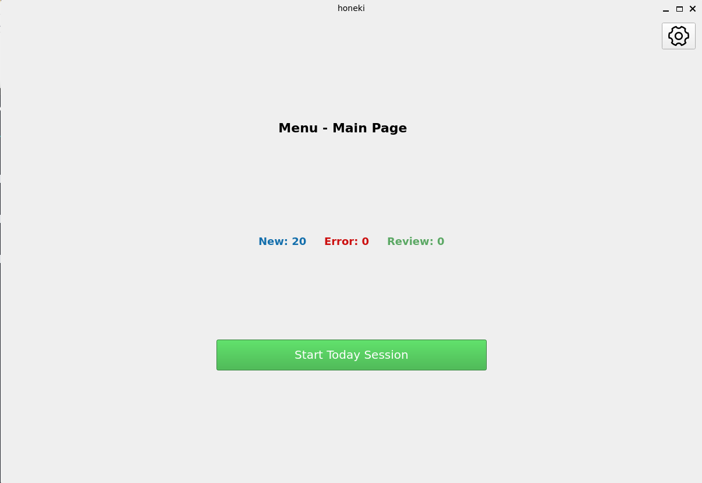
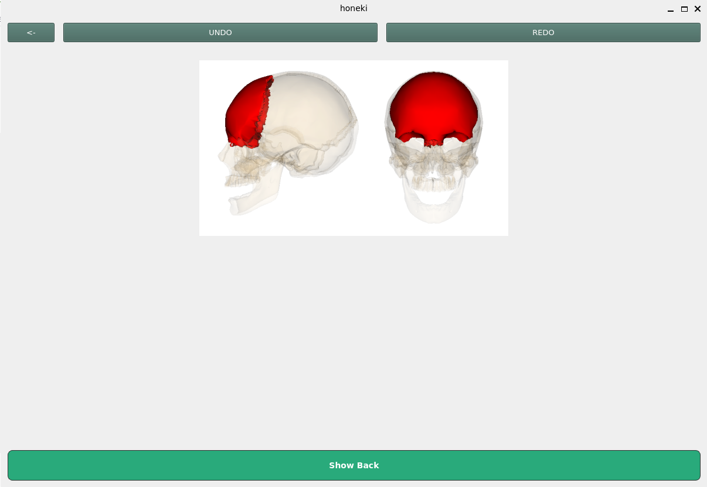
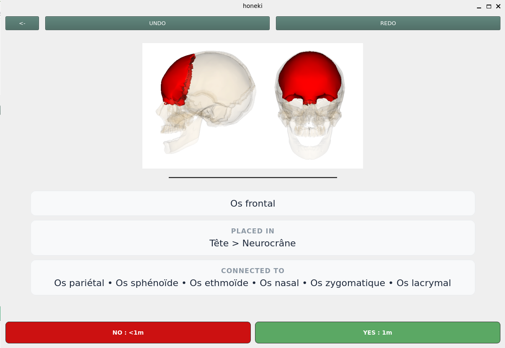
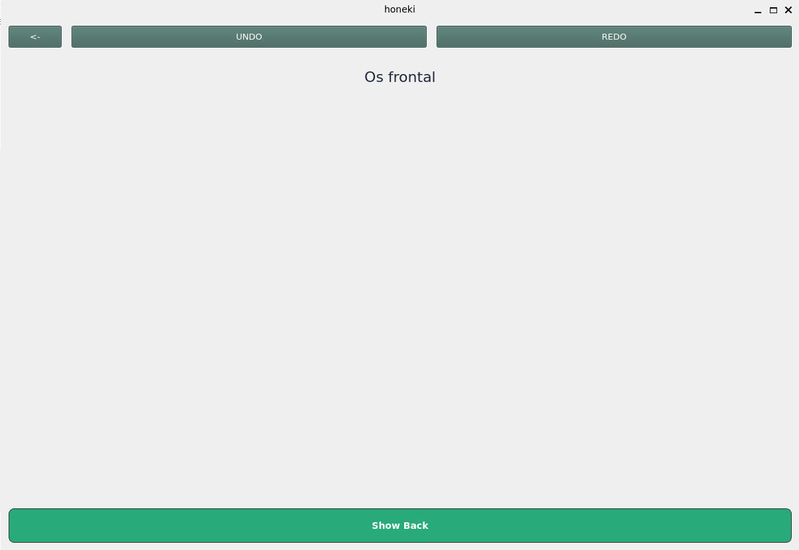
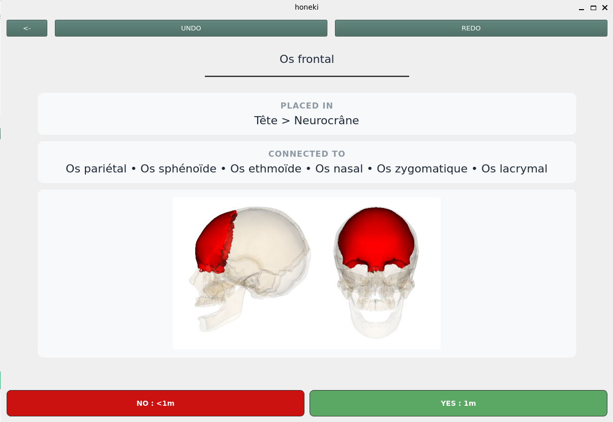
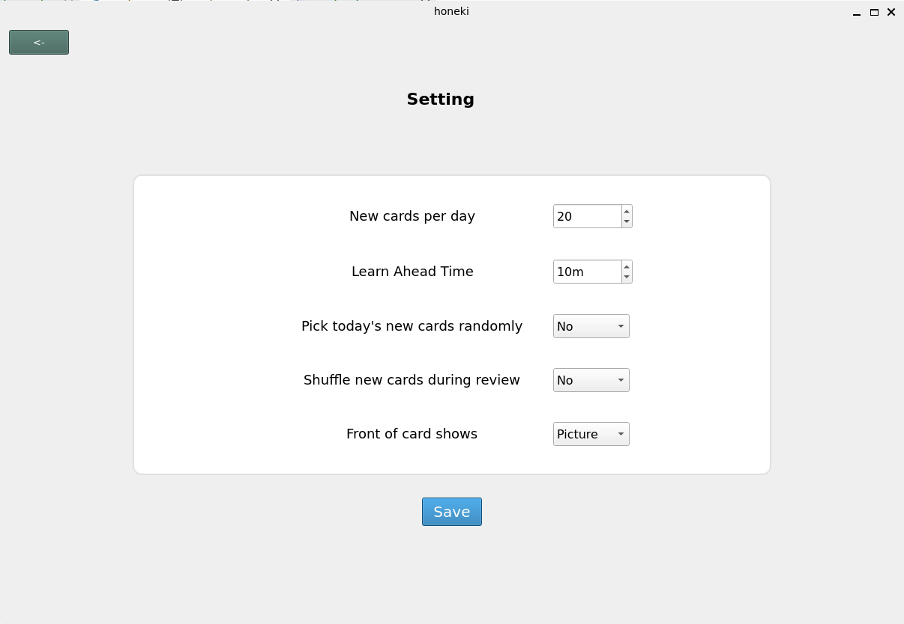

# 🦴 骨記 (ほねき)

## 📝 About

**骨記 (Honeki)** is a personal project designed to replicate the Anki flashcard system specifically for learning human bones. 
I built it to practice Rust, Python (*PySide6*), *Justfile*, and core software development principles.

### 🧠 What is Anki

It is a flashcard system based on the [Ebbinghaus forgetting curve](https://en.wikipedia.org/wiki/Forgetting_curve) (though Anki relies on its own memory models like SM-2 or FSRS). It schedules reviews daily to ensure you review cards right before you forget them.

> **Disclaimer:** This project is heavily inspired by [Anki](https://apps.ankiweb.net). It was created solely for educational purposes to practice software development, with no commercial intent or claim over the original concept.

## 🎴 Features



The application comes with a built-in deck focusing on human body bones, containing:
- Name
- Image / GIF
- Location / Placement
- Connections

> ⚠️ *Note: Currently, the card content is only available in French.*

### 🔄 Review Mode

Choose between two display modes (**Picture** or **Name**) in the settings. During a session, reveal the answer and rate your recall:

#### Picture Front Mode
| Front (Question) | Back (Answer) |
| :---: | :---: |
|  |  |

#### Name Front Mode
| Front (Question) | Back (Answer) |
| :---: | :---: |
|  |  |

- **Actions:** 
	- Reveal the back of the card.
	- Rate your recall (**Yes** or **No**).
	- **Undo / Redo** actions in case of accidental inputs.


### ⚙️ Settings



You can configure five key settings:
- **New cards per day** (Default: 20)
- **Learn Ahead Time (LAT)** (Default: 10 mins): Time window before a review deadline when a card becomes eligible for early review.
- **Pick today's new cards randomly** (Default: False)
- **Shuffle new cards during review** (Default: False)
- **Front of card shows** (Default: Picture): Choose whether the front displays the bone's **Name** or **Picture**.


## 🚀 Getting Started

### Prerequisites
Make sure you have Python, Rust, and [Just](https://github.com/casey/just) installed.

### Setup and Running

1. **Set up the virtual environment and Maturin:**
```sh
just setup
```

2. **Build the application:**
```sh
just build
```

3. **Run the application:**
```sh
just run
```

Alternatively, build and run in a single command:

```sh
just dev

```

> *(Note: Equivalent commands are also available via the `Makefile`.)*
